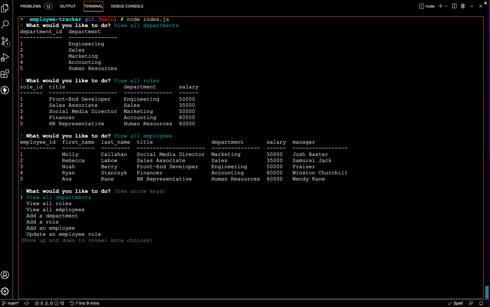

# employee-tracker MIT 
  ## Description
  This project was motivated by the intent to learn how to utilize mySQL2 package in a command-line node application. The project is able to add employees, roles and departments and save it to a local database. It also allows the user to view all departments, role, employees and update employee info(i.e. role and manager). I learned how to use mySQL2 and the console.table package. I also learned how to create databases and tables within databases using mysql.

  ## Table of Contents
  - [Installation](#installation)
  - [Usage](#usage)
  - [Credits](#credits)
  - [License](#license)
  
  ## Installation
  npm install all packages then run node index.js in terminal

  ## Usage

  

  [Link to Video](https://drive.google.com/file/d/1zLQU_YB8uMui9iw9WirqTb7-WXHY3gIC/view?usp=sharing)
  
  ## Credits
  Not Applicable

  ## License
  

  Copyright 2022 Tina Stanczyk

  Permission is hereby granted, free of charge, to any person obtaining a copy of this software and associated documentation files (the "Software"), to deal in the Software without restriction, including without limitation the rights to use, copy, modify, merge, publish, distribute, sublicense, and/or sell copies of the Software, and to permit persons to whom the Software is furnished to do so, subject to the following conditions:
  
  The above copyright notice and this permission notice shall be included in all copies or substantial portions of the Software.
  
  THE SOFTWARE IS PROVIDED "AS IS", WITHOUT WARRANTY OF ANY KIND, EXPRESS OR IMPLIED, INCLUDING BUT NOT LIMITED TO THE WARRANTIES OF MERCHANTABILITY, FITNESS FOR A PARTICULAR PURPOSE AND NONINFRINGEMENT. IN NO EVENT SHALL THE AUTHORS OR COPYRIGHT HOLDERS BE LIABLE FOR ANY CLAIM, DAMAGES OR OTHER LIABILITY, WHETHER IN AN ACTION OF CONTRACT, TORT OR OTHERWISE, ARISING FROM, OUT OF OR IN CONNECTION WITH THE SOFTWARE OR THE USE OR OTHER DEALINGS IN THE SOFTWARE.
  
  

  https://opensource.org/licenses/MIT

  ## Badges
  Not Applicable

  ## Features
  Not Applicable

  ## How to Contribute
  Invest in my future development.

  ## Tests
  Not Applicable.

  ## Questions
  Contact me here if you have further questions: 

  Email - t9.stanczyk@gmail.com 

  Github - https://github.com/tinastanczyk 
